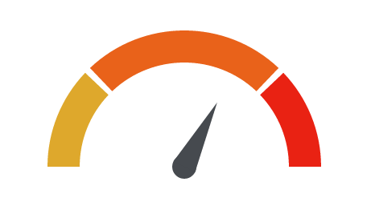

# d3 guage bower package.

### Demo

[Example](http://malikid.github.io/ng-d3-guage/example/)  

or

1. Clone this repository.
2. Go into directory, and type `grunt server` / `grunt example`.


### Bower Package

Name: **ng-d3-guage**  


### Environment

angular: ~1.2.18  
d3: ~3.4.11  


###Usage

- Bower install.
```
bower install ng-d3-guage
```

- Set the directive anywhere you want.
```
d3-guage(guage-option="guageOption")
```

- Import module to your app module.
```
angular.module("demo", ["d3Guage"])
```

- Set the option in your controller.
```
$scope.guageOption =
  show: true
  startPercent: .75
  barWidth: 40
  paddingRadius: .05
  pointer:
    percent: .65
    length: 90
    radius: 15
  sections: [
    {
      percent: .25
      className: "chart-color1"
    }
    {
      percent: .50
      className: "chart-color2"
    }
    {
      percent: .25
      className: "chart-color3"
    }
    ... Add as many sections as you want.
  ]
```

- Set the css.

- Done!

- If you want to reset pointer to another percent, just directly set guageOption.pointer.percent to another value and the pointer will animate to the value.

- If you want to reset sections to another percent, just directly set percent of any one of guageOption.sections to another value and trigger svg to reset.

###Example




###Reference

[Jake Trent's CodePen](http://codepen.io/jaketrent/pen/eloGk)


